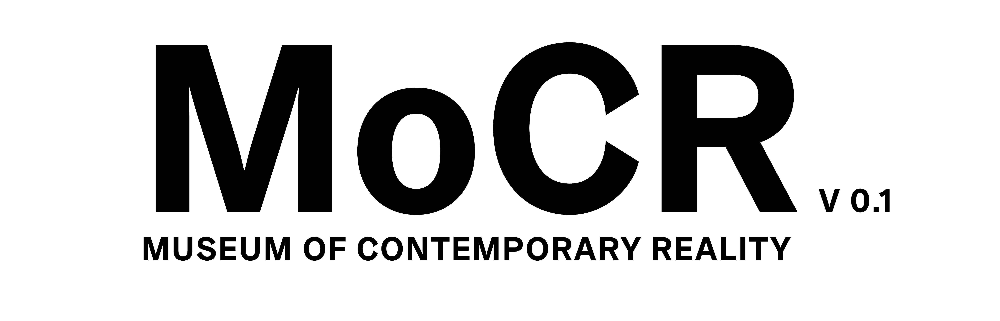

<h3>Museum of Contemporary Reality</h3>

This repository is a component collection for a digital environment that can be used as museum, gallery or else. All software is written in C# und Unity Engine 2018.4.16 (LTS). This Hub is currently in development, so major changes are obvious. Stable releases will be announced here.

You can have a sneak peak at the latest prototypes. We currently develop for Android only. Download APK here: https://drive.google.com/open?id=1vy0vsnNtphv2WrGWwfBqtp1HrEjKoDPt

MoCR is part of a lecture series by http://tristanschulze.de at the art university Burg Giebichenstein / Halle ( Multimedia | Virtual Reality )

You will find mainly code only setups for compatibility reasons. The code will be commented, so you get an idea how to prepare your unity scene. Use this code feely with no usage or copyright restrictions. 
